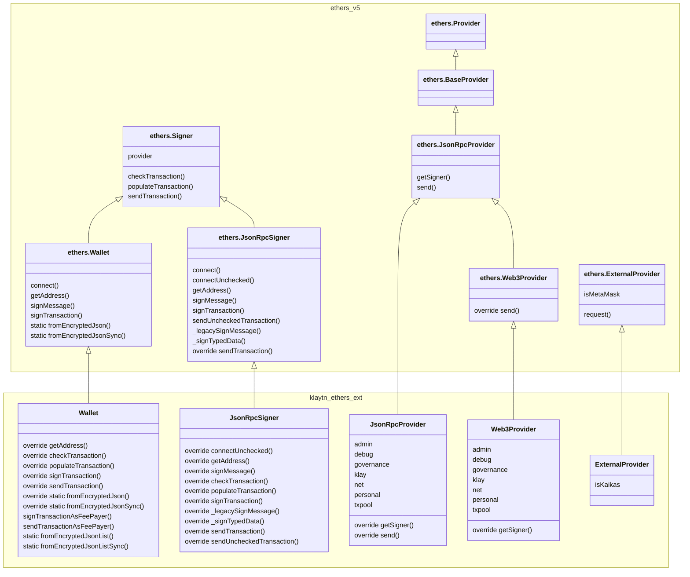

# Ethers.js Extension for Klaytn

Ethers.js Extension for Klaytn offers:

- Drop-in replacement to `ethers.Wallet` that handles both Ethereum and Klaytn transaction types
  involving AccountKey and TxTypes.
- Drop-in replacement to `ethers.providers.JsonRpcProvider` that provides accesses to both Ethereum RPCs and
  Klaytn-specific RPCs.
- Drop-in replacement to `ethers.Web3Provider` to work with both MetaMask (`window.ethereum`) and Kaikas (`window.klaytn`)

## Note for ethers v6

`@kaiachain/ethers-ext` supports both ethers v5 and v6. However, you need to use the right packages which are specified for each `ethers` version. So ethers v5 must be used with packages from `@kaiachain/ethers-ext/v5` and ethers v6 is only compatible with `@kaiachain/ethers-ext/v6`.

> **_NOTE:_**
> If the import path has no version sub-path (`@kaiachain/ethers-ext`) ethers v5 is used by default.

- **Don't**: mix ethers v6 and ethers-ext for ethers v5

  ```js
  const ethers = require("ethers"); // ethers v6
  const { Wallet } = require("@kaiachain/ethers-ext/v5");

  const provider = new ethers.JsonRpcProvider(
    "https://public-en-kairos.node.kaia.io"
  );
  const wallet = new Wallet("<private key>", provider);
  ```

- **Do**: Using with ethers v5

  ```js
  const ethers = require("ethers"); // ethers v5
  const { Wallet } = require("@klaytn/ethers-ext/v5");

  const provider = new ethers.providers.JsonRpcProvider(
    "https://public-en-kairos.node.kaia.io"
  );
  const wallet = new Wallet("<private key>", provider);
  ```

- **Do**: Using with ethers v6

  ```js
  const ethers = require("ethers"); // ethers v6
  const { Wallet } = require("@klaytn/ethers-ext/v6");

  const provider = new ethers.JsonRpcProvider(
    "https://public-en-kairos.node.kaia.io"
  );
  const wallet = new Wallet("<private key>", provider);
  ```

- **Do**: ethers-ext only

  ```js
  const { Wallet, JsonRpcProvider } = require("@kaiachain/ethers-ext/v5");
  // or
  const { Wallet, JsonRpcProvider } = require("@kaiachain/ethers-ext/v6");

  const provider = new JsonRpcProvider("https://public-en-kairos.node.kaia.io");
  const wallet = new Wallet("<private key>", provider);
  ```

## Install

### Node.js

- Install
  ```sh
  npm install --save @kaiachain/ethers-ext ethers@5 # or ethers@6
  ```
- ESM or TypeScript

  ```ts
  import { Wallet, JsonRpcProvider } from "@klaytn/ethers-ext";

  // esm
  // v5
  import { v5 } from "@klaytn/ethers-ext";
  const { Wallet, JsonRpcProvider } = v5;
  // v6 
  import { v6 } from "@klaytn/ethers-ext";
  const { Wallet, JsonRpcProvider } = v6;

  // esm subpath import. If using typescript, add "moduleResolution": "nodenext" to tsconfig.json
  // v5
  import { Wallet, JsonRpcProvider } from "@klaytn/ethers-ext/v5";
  // v6
  import { Wallet, JsonRpcProvider } from "@klaytn/ethers-ext/v6";

  const provider = new JsonRpcProvider("https://public-en-kairos.node.kaia.io");
  const wallet = new Wallet("<private key>", provider);
  ```

- CommonJS

  ```js
  // v5
  const { Wallet, JsonRpcProvider } = require("@klaytn/ethers-ext");
  const { Wallet, JsonRpcProvider } = require("@klaytn/ethers-ext").v5;
  const { Wallet, JsonRpcProvider } = require("@klaytn/ethers-ext/v5");
  // v6
  const { Wallet, JsonRpcProvider } = require("@klaytn/ethers-ext").v6;
  const { Wallet, JsonRpcProvider } = require("@klaytn/ethers-ext/v6");

  const provider = new JsonRpcProvider("https://public-en-kairos.node.kaia.io");
  const wallet = new Wallet("<private key>", provider);
  ```

### Browser

It is not recommended to use CDNs in production, But you can use below for quick prototyping. using `ethers-ext.buldle.js` for ethers v5 and `ethers-ext.v6.bundle.js` for ethers v6

```html
<script src="https://cdn.jsdelivr.net/npm/@kaiachain/ethers-ext@latest/dist/ethers-ext.bundle.js"></script>
<script>
  const provider = new ethers_ext.providers.Web3Provider(window.klaytn);
</script>
```

## Usage

See [example](./example) and [test](./test).

## Class extension design


